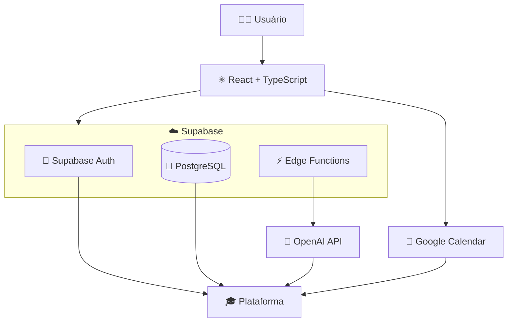
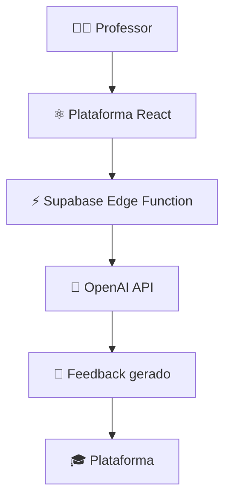

# 🎓 Plataforma de Gestão de Aulas

Aplicação Full Stack desenvolvida para centralizar o gerenciamento de aulas online, alunos, professores, avaliações, agendamentos e acompanhamento acadêmico.

O projeto nasceu de uma necessidade real da minha atuação como professora e mentora de programação e está sendo desenvolvido inicialmente para uso próprio, com possibilidade futura de disponibilização como produto para outros professores.

A plataforma utiliza **React + TypeScript** no front-end e **Supabase/PostgreSQL** no back-end, com autenticação, controle de acesso, Edge Functions, migrations, integração com Google Calendar e geração de feedbacks de avaliações com Inteligência Artificial.

> 🚀 Primeira versão já publicada em produção na Vercel.
>
> 🚧 Projeto autoral em desenvolvimento ativo.

---

## 🌐 Aplicação publicada

A primeira versão da plataforma está disponível em produção na Vercel.

[🔗 Acessar Plataforma de Ensino](https://plataforma-ensino-git-main-andrea-francas-projects.vercel.app/)

---

## 🎯 Objetivo do projeto

Criar uma plataforma que permita organizar o processo de ensino de forma centralizada, reduzindo a necessidade de utilizar diversas ferramentas separadas para acompanhar alunos, aulas e informações acadêmicas.

Além do objetivo de uso real, o projeto também funciona como aplicação prática de conceitos de:

- Desenvolvimento Full Stack
- Arquitetura de aplicações React
- Autenticação e autorização
- Integração com APIs
- Banco de dados relacional
- Funções server-side
- Inteligência Artificial aplicada
- Deploy e configuração de ambientes de produção

---

## 🚀 Tecnologias

### Front-end

- React
- TypeScript
- React Router
- Tailwind CSS
- Vite

### Back-end / Banco de dados

- Supabase
- PostgreSQL
- Supabase Auth
- Supabase Edge Functions
- Migrations

### Inteligência Artificial

- OpenAI API
- Geração assistida de feedbacks acadêmicos
- Processamento de chamadas de IA por meio de Supabase Edge Functions

### Integrações

- Google Calendar
- OpenAI API

### Deploy / Infraestrutura

- Vercel
- Supabase

### Desenvolvimento

- Git
- GitHub
- ESLint
- npm

---

## 🏗️ Arquitetura

A aplicação utiliza uma arquitetura Full Stack baseada em **React + TypeScript** no cliente e nos serviços do **Supabase** no back-end.

O React é responsável pela interface e pelos fluxos da aplicação, enquanto o React Router realiza o gerenciamento das rotas.

O Supabase fornece serviços de autenticação, banco de dados PostgreSQL e Edge Functions utilizadas para operações que precisam ser executadas fora do navegador.

Integrações com serviços externos, como a API da OpenAI, são realizadas por meio das Edge Functions, evitando a exposição de credenciais privadas no front-end.

A aplicação também possui integração com o Google Calendar para auxiliar no gerenciamento e sincronização dos agendamentos.

### Visão simplificada da arquitetura



---

## ✨ Funcionalidades

A plataforma já possui diferentes fluxos voltados para professores, alunos e administração, incluindo:

- Autenticação e rotas protegidas
- Gestão e vinculação de alunos
- Dashboard e recursos para professores
- Gerenciamento e visualização de aulas
- Agendamento de aulas
- Confirmação de aulas
- Cancelamento de aulas
- Reagendamento de aulas
- Integração e sincronização com Google Calendar
- Sincronização de disponibilidade para agendamentos
- Sistema de avaliações acadêmicas
- Geração de feedbacks com Inteligência Artificial
- Processamento seguro das chamadas de IA por meio de Supabase Edge Functions
- Histórico e relatórios dos alunos
- Gerenciamento de perfil
- Recuperação e redefinição de senha
- Área de gerenciamento do sistema
- Recursos de gestão comercial
- Banco de dados PostgreSQL com migrations versionadas
- Edge Functions no Supabase para operações de back-end

> Algumas funcionalidades ainda estão em desenvolvimento e podem sofrer alterações durante a evolução do projeto.

---

## 🤖 Avaliações com Inteligência Artificial

Um dos recursos da plataforma é a **geração assistida de feedbacks para avaliações dos alunos utilizando Inteligência Artificial**.

O professor registra as informações da avaliação e a plataforma envia os dados para uma **Supabase Edge Function**, responsável pelo processamento da requisição e pela comunicação com a **OpenAI API**.

O feedback gerado é então devolvido à aplicação para utilização pelo professor.

Essa arquitetura permite utilizar Inteligência Artificial no processo pedagógico sem expor credenciais privadas da API diretamente no front-end.

### Fluxo simplificado



A IA funciona como ferramenta de apoio ao processo de avaliação, auxiliando na elaboração dos feedbacks a partir das informações registradas pelo professor.

---

## 👥 Perfis de usuário

A arquitetura da plataforma está sendo desenvolvida para trabalhar com diferentes tipos de usuários.

### 👑 Administrador

Responsável pelo gerenciamento geral da plataforma, usuários e recursos administrativos.

### 👩‍🏫 Professor

Responsável pelo gerenciamento de seus alunos, aulas, avaliações, agendamentos e informações acadêmicas.

### 👨‍🎓 Aluno

Acesso às informações e recursos disponibilizados pelo professor.

---

## 📂 Estrutura do projeto

```text
plataforma-ensino/
│
├── public/
│
├── src/
│   ├── assets/
│   ├── components/
│   ├── lib/
│   ├── pages/
│   ├── App.tsx
│   └── main.tsx
│
├── supabase/
│   ├── functions/
│   └── migrations/
│
├── package.json
├── vite.config.ts
├── tsconfig.json
└── README.md
```

---

## ⚙️ Executando o projeto

### 1. Clone o repositório

```bash
git clone https://github.com/dejandrea/plataforma-ensino.git
```

### 2. Entre na pasta

```bash
cd plataforma-ensino
```

### 3. Instale as dependências

```bash
npm install
```

### 4. Configure as variáveis de ambiente

Crie um arquivo `.env` na raiz do projeto e configure as variáveis públicas necessárias para conexão com o Supabase:

```env
VITE_SUPABASE_URL=
VITE_SUPABASE_ANON_KEY=
```

Preencha os valores de acordo com as configurações do seu projeto no Supabase.

> ⚠️ Credenciais privadas, Service Role Keys, senhas e outras chaves sensíveis não devem ser expostas no front-end nem versionadas no repositório.

### 5. Execute o projeto

```bash
npm run dev
```

A aplicação será iniciada em ambiente de desenvolvimento.

---

## 🧪 Scripts disponíveis

### Desenvolvimento

```bash
npm run dev
```

Executa o projeto em ambiente de desenvolvimento.

### Build

```bash
npm run build
```

Gera a versão otimizada da aplicação para produção.

### Lint

```bash
npm run lint
```

Executa a análise do código utilizando ESLint.

### Preview

```bash
npm run preview
```

Executa localmente a versão gerada para produção.

---

## 🗺️ Roadmap

O desenvolvimento é contínuo e novas funcionalidades são adicionadas conforme a utilização e validação da plataforma.

Entre as próximas evoluções planejadas estão:

- Evolução da gestão de alunos
- Evolução da gestão de professores
- Evolução do sistema de avaliações
- Aprimoramento dos feedbacks gerados com IA
- Histórico e análise de desempenho dos alunos
- Emissão de certificados
- Melhorias no gerenciamento de aulas
- Dashboard com métricas acadêmicas
- Melhorias de experiência do usuário
- Novas integrações
- Otimizações de desempenho
- Preparação da aplicação para utilização por outros professores

---

## 💡 Motivação

Este projeto surgiu de uma necessidade real.

Como professora e mentora de programação, percebi que diversas informações importantes para o acompanhamento dos alunos acabam distribuídas entre diferentes ferramentas.

Agendamentos, informações acadêmicas, avaliações, acompanhamento dos alunos e organização das aulas frequentemente precisam ser administrados utilizando serviços diferentes.

A proposta da plataforma é transformar essa experiência em uma **solução centralizada para gerenciamento do processo de ensino**.

Inicialmente, a aplicação está sendo desenvolvida para atender às necessidades da minha própria rotina profissional e, futuramente, poderá evoluir para uma solução utilizada por outros profissionais da educação.

O projeto também representa a aplicação prática dos conhecimentos que venho aprofundando em desenvolvimento de software, incluindo **React, TypeScript, APIs, Supabase, PostgreSQL, autenticação, funções server-side, Inteligência Artificial e deploy de aplicações Full Stack**.

---

## 📌 Status

### 🚀 Em produção e desenvolvimento ativo

A primeira versão da plataforma já foi publicada na **Vercel** e está integrada ao **Supabase**.

Atualmente, o projeto possui fluxos funcionais envolvendo autenticação, gerenciamento acadêmico, agendamento de aulas, banco de dados e avaliações com geração de feedback utilizando Inteligência Artificial.

O desenvolvimento continua de forma incremental, com novas funcionalidades sendo implementadas e validadas conforme o uso real da plataforma.

---

## 👩‍💻 Desenvolvedora

**Andrea França**

Desenvolvedora de Software | React | JavaScript | TypeScript | Python

GitHub: [@dejandrea](https://github.com/dejandrea)

---

<p align="center">
  Desenvolvido como projeto autoral para aplicação prática em um contexto real de ensino.
</p>
